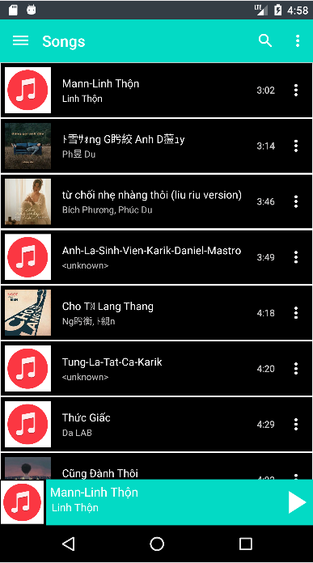
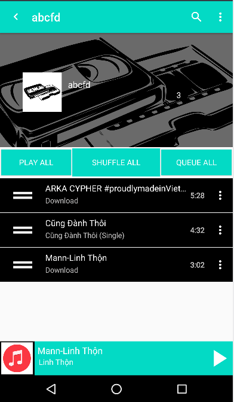
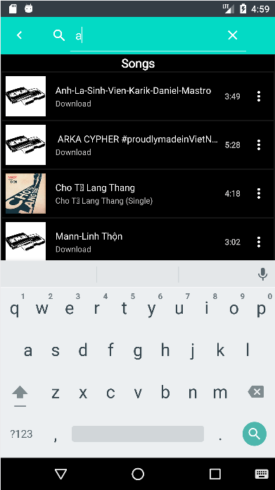
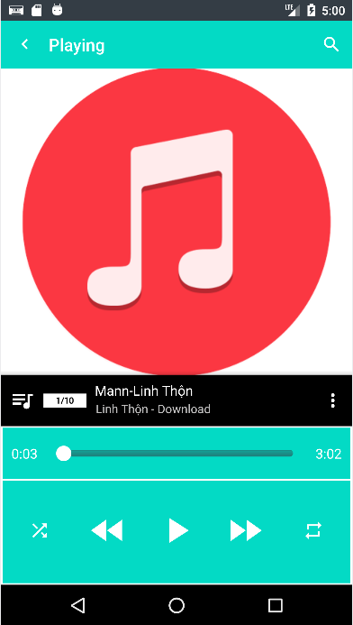

 

  

  <h3 align="center">MusicPlayer</h3>

  

    A music player for android
     
    <a href="https://github.com/othneildrew/Best-README-Template"><strong>Explore the docs »</strong></a>
     
     
    <a href="https://github.com/dung8466/MusicPlayer">View Demo</a>
    ·
    <a href="https://github.com/dung8466/MusicPlayer/issues">Report Bug</a>
    ·
    <a href="https://github.com/dung8466/MusicPlayer/issues">Request Feature</a>
  

  
Table of Contents

  <ol>
    <li>
      <a href="#about-the-project">About The Project</a>
      <ul>
        <li><a href="#built-with">Built With</a></li>
      </ul>
    </li>
    <li><a href="#feature">Feature</a></li>
    <li><a href="#demo">Demo</a></li>
    <li><a href="#license">License</a></li>
  </ol>

## About The Project

<table>
  <tr>
    <td>Main</td>
     <td>Playlist</td>
     <td>Search</td>
     <td>Song play</td>
  </tr>
  <tr>
    <td></td>
    <td></td>
    <td></td>
    <td></td>
  </tr>
 </table>

(<a href="#readme-top">back to top</a>)

### Built With

* [Java](https://www.java.com/en/)

(<a href="#readme-top">back to top</a>)

## Feature
- [x] Manage categories: song title, artist, Album, folder, playlist :tada:

- [x] Play, Pause, Next, Prev, Repeat, Random songs :tada:
- [x] Play, Pause, Next, Prev songs from notification bar :tada:
- [x] Use Service to run in the background :tada:
- [x] Create/delete playlist, add/remove songs to playlist :tada:
- [x] Search song title, artist name, album name :tada:

(<a href="#readme-top">back to top</a>)

## Demo

<ul>
  <li><a href="https://youtu.be/pDW81AwAV3M">Youtube</a></li>
  <li><a href="https://drive.google.com/file/d/1M1rpHYwtS_tERF_BQEESl8XWHGY6z5OT/view?usp=sharing">Google Drive</a></li>
  <li><a href="https://github.com/dung8466/MusicPlayer/tree/main/Video%20demo">Github</a></li>
</ul>

(<a href="#readme-top">back to top</a>)

## License

Distributed under the MIT License. See `LICENSE.txt` for more information.

(<a href="#readme-top">back to top</a>)

